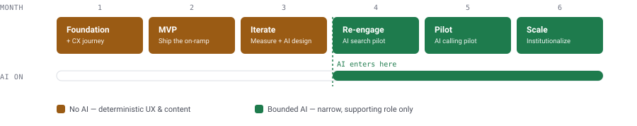

# First-Time Investor Activation | Zerodha

**PM II Candidate Assignment — Case Study**
Author: Arundhati Mahapatro

**Live demo:** [Slide deck](https://arundhatimahapatro-holymuse.github.io/first-time-investor-activation/deck/) · [Clickable prototype](https://arundhatimahapatro-holymuse.github.io/first-time-investor-activation/prototype/)
*(browsing the repo instead? [deck/index.html](deck/index.html) · [prototype/index.html](prototype/index.html))*

---

## TL;DR (30-second read)

- **Problem:** First-time investors open a Zerodha account, deposit money, and freeze — no default next step, a raw trading terminal, and no scaffolding for someone who doesn't know what to buy. The freeze starts even earlier than that: onboarding itself asks a beginner to pick "Equity & Mutual Funds / F&O / Commodity" right after PAN entry, with zero explanation. Industry-wide, only ~30–40% of demat accounts show any transaction in a 12-month window.
- **AI verdict:** **AI can be a catalyst here — it's very difficult for it to be the whole solution.** This is ~70% UX/content/product-structure and ~30% narrowly-scoped AI (content sequencing + nudge personalization — never stock recommendations). Leadership's "solve it with AI" framing is the wrong default and the assignment explicitly rewards saying so.
- **Solution:** A **"First ₹500"** guided on-ramp — a dismissible "Start Here" card, a multi-select intent router (not advice), a tiny reversible first action (₹500 index-fund SIP), in-context micro-education, an on-demand "talk to a person" option, and risk-modeled re-engagement nudges for users who deposit and go quiet.
- **Goal & mother metric:** Increase activation % for first-time investors — % who invest at least once within 30 days of first deposit.
- **Sequencing:** Ship the deterministic UX fix in month 1–3 (month 1 also turns all this research into a documented CX journey map). AI design starts month 3, first bounded pilots — AI-assisted search discovery, then an AI-calling nudge experiment — ship month 4 and 5, once the baseline flow is already proven.

---

## 1. Assignment brief

> You are a PM at Zerodha. A large share of first-time investors open a demat account, deposit money, and then freeze because they do not know what to do next. Leadership believes this can be solved with AI, but is not fully convinced. **First evaluate whether AI is actually the right lens for this problem** — UX, content, incentives, human intervention, AI, or a combination — and defend the call. Only then design the solution.

*(Condensed above from the original assignment PDF; full evaluation criteria, submission format, and disclaimers omitted here for brevity.)*

---

## 2. The real journey (not assumed)

Before framing the problem, I walked the actual Kite app end to end — both the **post-login experience** (screen recording of a live account, frames below) and the **onboarding/signup flow itself** — and cross-checked with onboarding teardowns, app-store reviews, and public forum complaints from first-time investors, since Zerodha's own domain is gated in the research tooling I had access to.

**Onboarding, before the app is even seen:** right after PAN entry, step 2 of 5 in signup asks *"What products would you like to start with?"* — toggles for **Equity & Mutual Funds / Futures & Options / Commodity**, sitting directly above a dense terms-and-conditions block (GTT policy, risk disclosure, CKYCR consent, standing instructions). A later step asks annual income, trading experience ("New" / "1–5 years" / etc.), and occupation. None of this is explained in beginner terms — a first-timer is asked to make a technical product choice, unassisted, before they've ever opened the app.

**Post-login, the screens below:**

| Screen | What it shows | Why it matters |
|---|---|---|
|  | Default home screen: a raw stock watchlist — ticker, price, % change. No CTA, no "getting started," nothing beginner-facing. | This is the **first thing** a user sees after money lands. Zero scaffolding. |
|  | SEBI-mandated disclosure shown at login: *"9 out of 10 individual traders in equity F&O incurred net losses."* | Regulatorily necessary and good for suitability — but for a first-timer with zero context, it's often the **first substantive message** they receive. It informs, but it also amplifies the fear that causes freezing. |
|  | SIPs live inside the *Orders* tab, several taps deep, alongside GTT/Baskets/Alerts — power-user vocabulary. | The single lowest-stakes first action (a SIP) is buried behind terminology a beginner hasn't learned yet. |
|  | An empty state ("no securities available") with no explanatory content or next step. | Representative of how empty/neutral states across the app default to silence rather than guidance. |
|  | Education (Varsity) and reporting (Console) live behind the profile menu — decoupled from the watchlist/order flow where the decision actually happens. | Confirms: **content exists, but is not in the flow.** Learning is homework, not help. |

**Same pattern, desktop web:** the Kite dashboard's only real CTA for an empty account is *"Start investing"* — a good instinct. But it drops straight into a raw instrument search. Searching the natural phrase a beginner would actually type, *"mutual fund,"* returns unexplained exchange codes — GOLDBETA, SBISENSEX, TSIFDG, NCAPBULADD — with no curation, no plain-English label, no "start here." The guidance ends exactly where the user needed it most.

This grounds the problem in what the product actually does today, not a hypothetical.

---

## 3. Voice of the customer

Apprehensions a first-timer is left holding, unanswered, the moment money lands:

> *"Where should I even invest?"*
> *"How should I invest — lump sum, SIP, what?"*
> *"How much is safe to put in as a first try?"*
> *"Should I even trust this app with my money?"*

Every one of these is answerable in principle (Varsity has the content, Kite has the SIP flow) — none of them are answered *in the moment they're being asked*.

---

## 4. Problem definition — and why it matters

**The gap:** Only ~30–40% of India's demat accounts show any transaction in a 12-month window.<sup>1</sup> In Zerodha's own onboarding research, 41.7% of users who *do* eventually invest take about a month to place their first trade after account creation.<sup>2</sup> Nationally, 63% of households are aware of market products but only 9.5% actually invest<sup>3</sup> — Zerodha inherits this awareness-to-action gap at the account level.

**Root causes, ranked by where they occur (the freeze starts earlier than "after deposit"):**

1. **The freeze starts during onboarding itself.** Step 2 of 5 in signup asks a beginner to pick Equity & Mutual Funds / F&O / Commodity — with dense T&Cs and zero hand-holding — before they've seen the app.
2. **No default next step.** Zerodha's brand is deliberately "we don't tell you what to buy" — no push-selling, no advisory calls, which is core to why it's trusted over Groww/Paytm Money by experienced traders. But a first-timer needs *some* scaffolding, and today gets none.
3. **Decision paralysis + fear of the "wrong" first move.** Real complaints (Quora/Reddit) converge on the same line: *"I put money in, now what do I even buy?"* Most arrived on social proof/FOMO, not a thesis.
4. **Education is decoupled from the decision** (see Profile/Console screen above) — Varsity is excellent but lives outside the flow where the decision is made.
5. **Product-surface mismatch.** The natural first action for a beginner (small SIP into an index fund) is buried inside Orders → SIPs, several taps and one vocabulary layer away from where they land.
6. **No re-engagement loop.** Nudges today are compliance-driven (the risk disclosure), not activation-driven — nothing brings a bounced user back with a low-stakes reason to return.

**Why it matters:**
- *Business:* dormant accounts generate zero brokerage/AUM against real sunk KYC/compliance cost, and represent live churn risk — a frustrated first-timer doesn't give up on investing, they try again on a competitor with more hand-holding.
- *Customer:* giving up after a failed first attempt can sour someone on investing entirely — a real financial-wellbeing cost, not just a funnel metric.

*Sources: <sup>1</sup>Choice India, dormant demat account analysis · <sup>2</sup>Zerodha Kite onboarding teardown (S. Baranwal) · <sup>3</sup>Acumen Group, Indian stock market investor participation study — full links in [Sources](#sources).*

---

## 5. AI evaluation — the explicit call

**AI can be a catalyst here — it's very difficult for it to be the whole solution.** This is ~70% UX/content/product-structure, ~30% narrowly-scoped AI.

**Why not AI-first:**
- **Regulatory ceiling.** Zerodha is a broker, not a registered investment adviser for retail stock-picking. An AI that recommends *what to buy* to a first-timer is a compliance risk, not a feature — hallucination on a financial product is a far worse failure mode than a bad restaurant recommendation.
- **The bottleneck is structural, not informational.** Users aren't stuck for lack of someone to ask — they're stuck because there's no visible, low-risk default action and the surface (a trading terminal) doesn't match their mental model ("start small and safe"). A chatbot on the same intimidating surface doesn't fix a missing on-ramp.
- **Trust needs proof, not explanation.** Fear of "getting it wrong" is better solved by shrinking the stakes of the first action than by a Q&A interface, which puts the burden of "what do I even ask" back on someone who doesn't know what they don't know.

Where AI *does* earn a role, it accelerates a UX fix that already works on its own — it can't manufacture the missing on-ramp by itself. That's the catalyst-not-solution distinction.

**Where AI earns its place — tightly bounded, and only after the deterministic fix ships:**

| Use | What it does | What it must never do |
|---|---|---|
| Content sequencing | Personalizes which Varsity module + what order/timing is surfaced, from a short intent quiz | Recommend a specific stock/fund |
| Nudge intelligence | Propensity model: which dormant user gets which nudge, on which channel, when | Auto-decide *what to invest in* on the user's behalf |
| In-context explainer | Answers "what does P/E mean," "explain this fund," scoped strictly to education | Answer "should I buy X" — hard-blocked by design, redirects to disclosure |

This is the answer the assignment is explicitly grading for: *"ability to challenge assumptions rather than default to AI."*

---

## 6. Target user

**"The motivated-but-unanchored first-timer"** — 22–35, urban/semi-urban, opened the account off social proof (a friend, a finfluencer, a first salary/bonus/FD maturity), deposited a modest sum (₹5k–₹25k). Has directional intent ("I should start investing") but no framework or vocabulary yet. Time-poor, anxious about being "wrong," influenced by finfluencer content but wary of stock tips.

This is **not** the trader persona who came for F&O/intraday — that segment self-activates immediately (as the risk-disclosure screen above implicitly targets) and isn't who freezes.

### Key assumption: two different "first-time" users

"First-time investor" collapses two different people: first time **on Zerodha**, and first time **investing at all**. This design deliberately targets the latter — the harder case, and the one leadership's framing is actually worried about.

**Signal already sitting in the product:** Zerodha's own onboarding asks trading experience at signup ("New" / "1–5 years" / "5–10 years" / etc.) — but nothing downstream acts on the answer. A genuine first-timer gets the identical unguided drop as a veteran switching brokers from Groww. That's a solvable gap, not a data gap.

### Other assumptions made explicit

- This segment is, at heart, MF/long-term oriented even though they signed up on a trading-first platform (unvalidated — would confirm via the intent-quiz data in month 1–2).
- The typical first deposit (₹5k–₹25k) is "money to start investing with," not the user's full savings — shapes how small a "starter" action can be.
- Freezing is driven more by *not knowing where to start* than by *not having enough information available* (Varsity already has the information — it's not surfaced or sequenced).
- Users who skip the guided path entirely are disproportionately experienced/trader-persona users who don't need it — the design must not degrade their flow.
- A 30-day window is the right measurement horizon for "activation," based on observed real behavior (41.7% of eventual investors take ~a month).

---

## 7. Solution — "First ₹500"

A guided on-ramp, fully optional/skippable so the self-directed power-user experience is untouched. **[Try the live, clickable prototype →](https://arundhatimahapatro-holymuse.github.io/first-time-investor-activation/prototype/)**

1. **Trigger moment** — right after first deposit clears, a dismissible **"Start Here"** card appears on the Watchlist home (see prototype) — persists until first investment, never a mandatory wizard.
2. **Intent check, multi-select** (routing, not advice) — *"What's this money for?"* (pick all that apply) then *"Pick stocks yourself, start simpler, or talk to someone?"* — routes to one of several pre-built, non-personalized paths. Never recommends an individual security.
3. **Shrink the stakes of action #1** — default suggested first action is a **₹500 index-fund SIP**, not "buy 10 shares of X." Small, reversible, removes single-stock-picking anxiety.
4. **In-context micro-education** — short, swipeable lesson cards pulling Varsity content directly into the decision surface, not a separate app.
5. **On-demand human assistance** — "I'd rather talk to someone" is a first-class option at every decision point, not a fallback. Requests a free callback, no sales pitch, no pressure to invest on the call.
6. **Re-engagement nudges** — Day 1 / 3 / 7 after a deposit with no action: education, social proof ("what other first-timers your age started with"), one-tap resume. AI-personalized only in phase 2 (see roadmap).
7. **Bounded AI helper**, on-demand, inside the education panel — explains concepts, refuses "should I buy" questions by design.
8. **Proactive human safety valve** — for high-deposit (>₹1L), still-inactive-after-14-days users: a proactive support callback, small-scale and high-trust, not automated. (This is the *push* counterpart to the *pull* option in step 5.)

---

## 8. Key trade-offs and risks

Every dimension the assignment calls out, walked through explicitly:

| Dimension | Trade-off / risk | How we handle it |
|---|---|---|
| **Complexity** | Multi-path routing (self-directed vs. guided vs. lessons vs. human) adds real branching logic to build and maintain. | Ship the single deterministic path first (month 1–3); other branches are additive, not blocking. |
| **Cost** | Propensity modeling, AI search, and AI calling all need real infrastructure and compliance investment. | AI spend is sequenced to month 3–6, scoped first and piloted small, after the free UX fix has already proven the lift. |
| **User trust** | Any default nudge risks diluting "we never push products" — the core trust brand. | Every default is framed as informational, never a recommendation, and fully skippable. |
| **Financial-product suitability** | A single ₹500 index-SIP default may not fit every income or risk profile. | Default is deliberately generic and low-stakes; self-directed and human-assisted paths stay fully open. |
| **Safety** | AI-generated text near financial decisions is a mis-selling risk if it drifts into advice. | Hard-coded refusal pattern, templated/compliance-reviewed copy, no free generation near security names. |
| **Scalability** | Rules-based nudges and human callbacks don't get cheaper as the dormant cohort grows into millions. | Propensity model built once volume justifies it; human callback stays scoped to high-deposit inactives, not offered at scale to everyone. |
| **Speed of implementation** | The full roadmap spans six months; leadership may want proof sooner. | The deterministic MVP ships in month 2 — the activation lift is measurable long before AI enters. |

---

## 9. Success metrics

**Goal:** increase activation % — the share of first-time investors who actually invest, not just accounts opened.

- **Mother metric:** % of first-time users who invest at least once within 30 days of first deposit — "Activation Rate."
- **Leading indicators:** TAT (median time from deposit to first investment); share of first-time investors vs. all active investors on the platform; guided-path engagement vs. skip-rate and conversion for each; 90-day second-transaction rate (activation that sticks, not one-and-done).
- **Guardrails:** avg. investment amount of first-time investors (should stay small/starter-sized, not creep up); support tickets citing "felt pushed"/mis-selling concern; any SEBI/advisory-boundary escalation (must stay zero); 30-day cancellation rate on guided SIPs; churn rate of guided cohort vs. control.

---

## 10. Six-month roadmap



| Phase | Month | Focus | Ships | AI involved? |
|---|---|---|---|---|
| 0 · Foundation | 1 | Instrumentation, research & CX journey | Baseline activation-rate measurement, deposit→first-trade event tracking, 10–15 first-timer interviews, compliance review of guided-path language — synthesized into a documented CX journey map (VoC, onboarding walkthrough, desktop-search findings) that becomes the reference for everything shipped after | No |
| 1 · Deterministic MVP | 2 | Ship the on-ramp | "Start Here" card, multi-select intent router, static paths incl. human-callback request, ₹500 index-SIP default, in-context lesson cards — A/B on new-signup cohort | No |
| 1 · Iterate | 3 | Measure, fix & scope the AI pilots | Analyze 30-day activation lift & time-to-first-investment, fix drop-off points, expand static paths based on real routing-answer data. In parallel: design + compliance-scope two bounded AI experiments — natural-language search/discovery, and an outbound AI-calling script for dormant users | No |
| 2 · Re-engagement + AI search pilot | 4 | Bring back the dormant | Day 1/3/7 nudges (rules-based, not ML) across push/email/WhatsApp, frequency capping, opt-out. Pilot AI-assisted search: a generic query like "mutual fund" returns a curated, plain-English shortlist instead of raw ticker codes — zero personalized recommendation, purely a discovery aid | Yes — narrow, supporting only |
| 3 · Nudge AI + AI-calling pilot | 5 | Add AI where it's earned its place | Propensity model for nudge timing/channel; bounded in-context explainer with hard advice-guardrails, compliance sign-off. Pilot outbound AI calling on a small dormant cohort — scripted, compliance-reviewed, hands off to a human for anything off-script, never recommends a security | Yes — narrow, supporting only |
| 3 · Scale | 6 | Institutionalize | Roll out whichever AI experiments proved lift — search discovery, propensity-driven nudges, AI calling; activation rate becomes a tracked company metric with a guardrail dashboard | Yes — scaled, still bounded |

AI design starts month 3, first bounded pilots ship month 4 — after the deterministic fix is proven, never as a substitute for it.

---

## Repo contents

```
├── README.md              # this file — brief, journey, VoC, full solution, roadmap
├── deck/index.html         # 12-slide deck — open in a browser, Cmd/Ctrl+P to export as PDF
├── prototype/index.html    # clickable prototype of the "First ₹500" on-ramp, incl. human-assist path
└── assets/screens/          # real Kite app screens + prototype screenshots
```

## Sources

- [Zerodha Kite Onboarding Teardown](https://shubhambrnw.medium.com/zerodha-kite-onboarding-teardown-535c4568a985)
- [Indian stock market investor participation stats](https://acumengroup.in/how-many-people-invest-in-the-stock-market-in-india/)
- [Demat account growth — Business Standard](https://www.business-standard.com/amp/markets/news/india-s-demat-tally-tops-120-mn-june-additions-highest-in-13-months-123070700203_1.html)
- [Dormant demat accounts — Choice India](https://choiceindia.com/blog/dormant-demat-account-meaning)
- [Zerodha Z-Connect — What's new, March 2025](https://zerodha.com/z-connect/featured/whats-new-at-zerodha-march-2025)
- Live Kite app walkthrough recording (screens in `assets/screens/`) and a walkthrough of the live onboarding/signup flow (PAN → product selection → income/experience/occupation)
