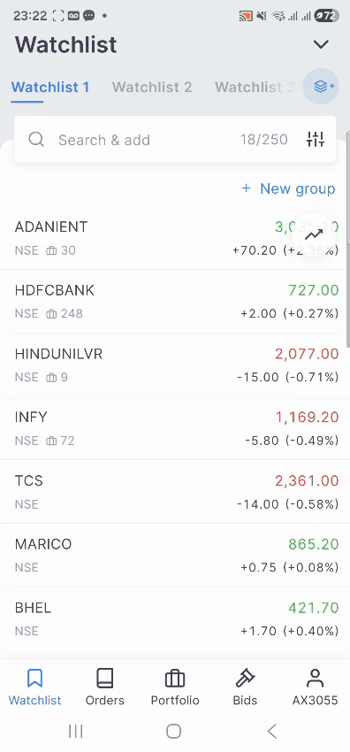
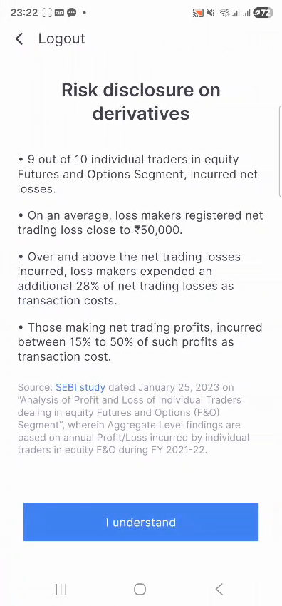
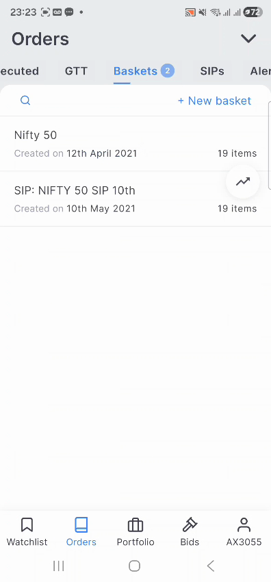
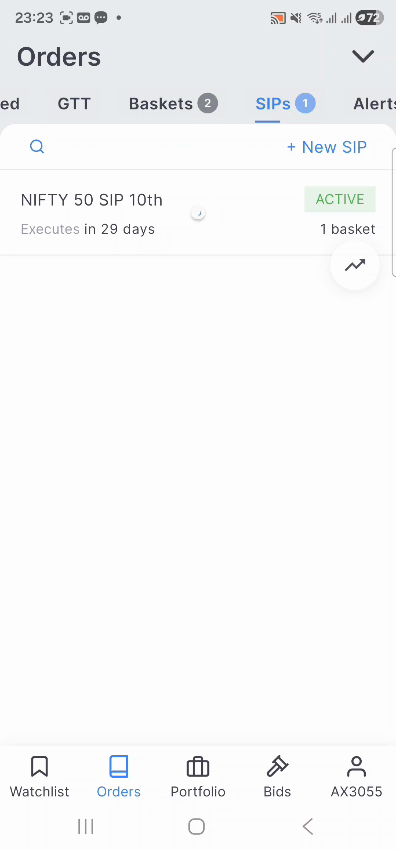
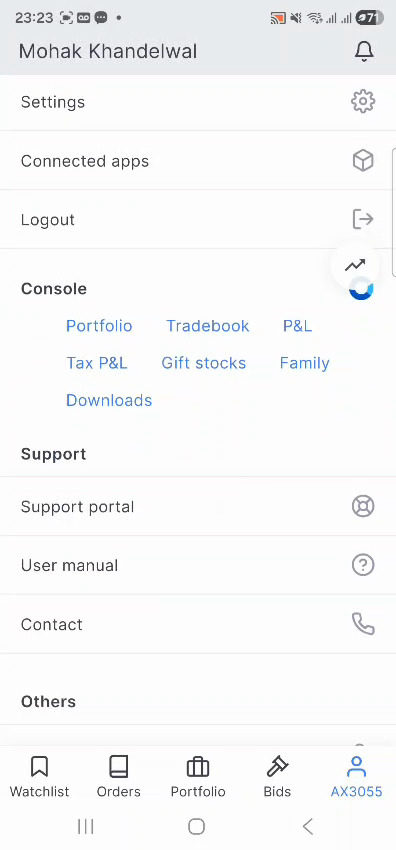

# First-Time Investor Activation | Zerodha

**PM II Candidate Assignment — Case Study**
Author: Arundhati Mahapatro · [Slide deck](deck/index.html) · [Clickable prototype](prototype/index.html)

---

## TL;DR (30-second read)

- **Problem:** First-time investors open a Zerodha account, deposit money, and freeze — no default next step, a raw trading terminal, and no scaffolding for someone who doesn't know what to buy. Industry-wide, only ~30–40% of demat accounts show any transaction in a 12-month window.
- **AI verdict:** **AI is not the primary lever.** This is ~70% UX/content/product-structure and ~30% narrowly-scoped AI (content sequencing + nudge personalization — never stock recommendations). Leadership's "solve it with AI" framing is the wrong default and the assignment explicitly rewards saying so.
- **Solution:** A **"First ₹500"** guided on-ramp — a dismissible "Start Here" card, a 2-minute intent router (not advice), a tiny reversible first action (₹500 index-fund SIP), in-context micro-education, and risk-modeled re-engagement nudges for users who deposit and go quiet.
- **North-star metric:** % of new demat accounts completing a first investment within 30 days of first deposit.
- **Sequencing:** Ship the deterministic UX fix in month 1–3. Layer AI only in month 4–6, once the baseline flow is proven — not before.

---

## 1. Assignment brief

> You are a PM at Zerodha. A large share of first-time investors open a demat account, deposit money, and then freeze because they do not know what to do next. Leadership believes this can be solved with AI, but is not fully convinced. **First evaluate whether AI is actually the right lens for this problem** — UX, content, incentives, human intervention, AI, or a combination — and defend the call. Only then design the solution.

*(Condensed above from the original assignment PDF; full evaluation criteria, submission format, and disclaimers omitted here for brevity.)*

---

## 2. The real journey (not assumed)

Before framing the problem, I walked the actual Kite app (screen recording of a live account, frames below) and cross-checked with onboarding teardowns, app-store reviews, and public forum complaints from first-time investors, since Zerodha's own domain is gated in the research tooling I had access to.

| Screen | What it shows | Why it matters |
|---|---|---|
|  | Default home screen: a raw stock watchlist — ticker, price, % change. No CTA, no "getting started," nothing beginner-facing. | This is the **first thing** a user sees after money lands. Zero scaffolding. |
|  | SEBI-mandated disclosure shown at login: *"9 out of 10 individual traders in equity F&O incurred net losses."* | Regulatorily necessary and good for suitability — but for a first-timer with zero context, it's often the **first substantive message** they receive. It informs, but it also amplifies the fear that causes freezing. |
|  | SIPs live inside the *Orders* tab, several taps deep, alongside GTT/Baskets/Alerts — power-user vocabulary. | The single lowest-stakes first action (a SIP) is buried behind terminology a beginner hasn't learned yet. |
|  | An empty state ("no securities available") with no explanatory content or next step. | Representative of how empty/neutral states across the app default to silence rather than guidance. |
|  | Education (Varsity) and reporting (Console) live behind the profile menu — decoupled from the watchlist/order flow where the decision actually happens. | Confirms: **content exists, but is not in the flow.** Learning is homework, not help. |

This grounds the problem in what the product actually does today, not a hypothetical.

---

## 3. Problem definition — and why it matters

**The gap:** Only ~30–40% of India's demat accounts show any transaction in a 12-month window. In Zerodha's own onboarding research, 41.7% of users who *do* eventually invest take about a month to place their first trade after account creation. Nationally, 63% of households are aware of market products but only 9.5% actually invest — Zerodha inherits this awareness-to-action gap at the account level.

**Root causes, in order of leverage:**

1. **No default next step.** Zerodha's brand is deliberately "we don't tell you what to buy" — no push-selling, no advisory calls, which is core to why it's trusted over Groww/Paytm Money by experienced traders. But a first-timer needs *some* scaffolding, and today gets none.
2. **Decision paralysis + fear of the "wrong" first move.** Real complaints (Quora/Reddit) converge on the same line: *"I put money in, now what do I even buy?"* Most arrived on social proof/FOMO, not a thesis.
3. **Education is decoupled from the decision** (see Profile/Console screen above) — Varsity is excellent but lives outside the flow where the decision is made.
4. **Product-surface mismatch.** The natural first action for a beginner (small SIP into an index fund) is buried inside Orders → SIPs, several taps and one vocabulary layer away from where they land.
5. **No re-engagement loop.** Nudges today are compliance-driven (the risk disclosure), not activation-driven — nothing brings a bounced user back with a low-stakes reason to return.

**Why it matters:**
- *Business:* dormant accounts generate zero brokerage/AUM against real sunk KYC/compliance cost, and represent live churn risk — a frustrated first-timer doesn't give up on investing, they try again on a competitor with more hand-holding.
- *Customer:* giving up after a failed first attempt can sour someone on investing entirely — a real financial-wellbeing cost, not just a funnel metric.

---

## 4. AI evaluation — the explicit call

**AI is not the primary lever. This is ~70% UX/content/product-structure, ~30% narrowly-scoped AI.**

**Why not AI-first:**
- **Regulatory ceiling.** Zerodha is a broker, not a registered investment adviser for retail stock-picking. An AI that recommends *what to buy* to a first-timer is a compliance risk, not a feature — hallucination on a financial product is a far worse failure mode than a bad restaurant recommendation.
- **The bottleneck is structural, not informational.** Users aren't stuck for lack of someone to ask — they're stuck because there's no visible, low-risk default action and the surface (a trading terminal) doesn't match their mental model ("start small and safe"). A chatbot on the same intimidating surface doesn't fix a missing on-ramp.
- **Trust needs proof, not explanation.** Fear of "getting it wrong" is better solved by shrinking the stakes of the first action than by a Q&A interface, which puts the burden of "what do I even ask" back on someone who doesn't know what they don't know.

**Where AI earns its place — tightly bounded, and only after the deterministic fix ships:**

| Use | What it does | What it must never do |
|---|---|---|
| Content sequencing | Personalizes which Varsity module + what order/timing is surfaced, from a short intent quiz | Recommend a specific stock/fund |
| Nudge intelligence | Propensity model: which dormant user gets which nudge, on which channel, when | Auto-decide *what to invest in* on the user's behalf |
| In-context explainer | Answers "what does P/E mean," "explain this fund," scoped strictly to education | Answer "should I buy X" — hard-blocked by design, redirects to disclosure |

This is the answer the assignment is explicitly grading for: *"ability to challenge assumptions rather than default to AI."*

---

## 5. Target user

**"The motivated-but-unanchored first-timer"** — 22–35, urban/semi-urban, opened the account off social proof (a friend, a finfluencer, a first salary/bonus/FD maturity), deposited a modest sum (₹5k–₹25k). Has directional intent ("I should start investing") but no framework or vocabulary yet. Time-poor, anxious about being "wrong," influenced by finfluencer content but wary of stock tips.

This is **not** the trader persona who came for F&O/intraday — that segment self-activates immediately (as the risk-disclosure screen above implicitly targets) and isn't who freezes.

### Assumptions made explicit

- This segment is, at heart, MF/long-term oriented even though they signed up on a trading-first platform (unvalidated — would confirm via the intent-quiz data in month 1–2).
- The typical first deposit (₹5k–₹25k) is "money to start investing with," not the user's full savings — shapes how small a "starter" action can be.
- Freezing is driven more by *not knowing where to start* than by *not having enough information available* (Varsity already has the information — it's not surfaced or sequenced).
- Users who skip the guided path entirely are disproportionately experienced/trader-persona users who don't need it — the design must not degrade their flow.
- A 30-day window is the right measurement horizon for "activation," based on observed real behavior (41.7% of eventual investors take ~a month).

### Pain points

- Doesn't know what a "good" first stock/fund looks like, or how to tell.
- Afraid that one wrong pick will cause a real loss (reinforced by the F&O risk-disclosure screen).
- Doesn't know the vocabulary (SIP, GTT, basket, F&O) well enough to navigate to the safest starting point.
- Has no low-stakes way to "practice" before committing real conviction.
- Nobody proactively reaches out once they've stalled — the silence itself reads as "there's nothing more to do here."

---

## 6. Solution — "First ₹500"

A guided on-ramp, fully optional/skippable so the self-directed power-user experience is untouched.

1. **Trigger moment** — right after first deposit clears, a dismissible **"Start Here"** card appears on the Watchlist home (see prototype) — persists until first investment, never a mandatory wizard.
2. **2-minute intent check** (routing, not advice) — *"What's this money for?"* + *"Pick stocks yourself, or start simpler?"* — routes to one of three pre-built, non-personalized paths. Never recommends an individual security.
3. **Shrink the stakes of action #1** — default suggested first action is a **₹500 index-fund SIP**, not "buy 10 shares of X." Small, reversible, removes single-stock-picking anxiety.
4. **In-context micro-education** — collapsible "New here?" panels pulling Varsity content directly into the decision surface, not a separate app.
5. **Re-engagement nudges** — Day 1 / 3 / 7 after a deposit with no action: education, social proof ("what other first-timers your age started with"), one-tap resume. AI-personalized only in phase 2 (see roadmap).
6. **Bounded AI helper**, on-demand, inside the education panel — explains concepts, refuses "should I buy" questions by design.
7. **Human safety valve** — for high-deposit (>₹1L), still-inactive-after-14-days users: a proactive support callback, small-scale and high-trust, not automated.

---

## 7. Key trade-offs and risks

- **Brand risk:** any guided default nudges against Zerodha's "we never push products" identity — mitigated by framing everything as factual/educational defaults, fully skippable.
- **Compliance surface** grows with AI-generated text near financial decisions — needs hard scoping, templated/human-reviewed content, and a documented refusal pattern.
- **Friction vs. speed paradox:** a 2-minute intent check adds friction at the moment we want zero — must be A/B tested, not assumed to help.
- **Build sequencing:** the deterministic UX fix ships fast; ML-personalized nudges are a slower phase 2 — the fast win must not wait on the slow one.
- **Nudge fatigue:** over-nudging cheapens trust and increases opt-outs — needs frequency capping from day one.

---

## 8. Success metrics

- **North-star:** % of new demat accounts completing a first investment within 30 days of first deposit ("Activation Rate").
- **Supporting:** guided-path engagement vs. skip-rate and conversion for each (isolates whether the intervention causes the lift); median time-to-first-investment; % of first investments that are small/starter-sized (validates we lowered stakes, not just moved the same behavior earlier); 90-day second-transaction rate (activation without repeat is a false positive).
- **Guardrails:** support tickets citing "felt pushed"/mis-selling concern; any SEBI/advisory-boundary escalation (must stay zero); 30-day cancellation rate on guided SIPs (proxy for pushing people into something they didn't understand); churn rate of guided cohort vs. control.

---

## 9. Six-month roadmap

| Phase | Month | Focus | Ships | AI involved? |
|---|---|---|---|---|
| 0 · Foundation | 1 | Instrumentation & research | Baseline activation-rate measurement, deposit→first-trade event tracking, 10–15 first-timer interviews, Varsity content audit, compliance review of guided-path language | No |
| 1 · Deterministic MVP | 2 | Ship the on-ramp | "Start Here" card, 2-question intent router, 3 static paths, ₹500 index-SIP default, in-context Varsity snippets — A/B on new-signup cohort | No |
| 1 · Iterate | 3 | Measure & fix | Analyze 30-day activation lift & time-to-first-investment, fix drop-off points, expand static paths based on real routing-answer data | No |
| 2 · Re-engagement | 4 | Bring back the dormant | Day 1/3/7 nudges (rules-based, not ML) across push/email/WhatsApp, frequency capping, opt-out, measure nudge-driven activation lift | No |
| 3 · Bounded AI pilot | 5 | Add AI where it's earned its place | Propensity model for nudge timing/channel personalization; bounded in-context explainer with hard advice-guardrails, compliance sign-off; pilot on a small % of dormant users | Yes — narrow, supporting only |
| 3 · Scale | 6 | Institutionalize | Roll out AI-personalized nudges fully if pilot metrics hold; activation rate becomes a tracked company metric with a guardrail dashboard; plan phase-2 backlog (human callback for high-deposit inactive users, richer path personalization) | Yes — scaled, still bounded |

AI enters deliberately late — once the deterministic fix is proven, not as a substitute for it.

---

## Repo contents

```
├── README.md              # this file — brief, journey, full solution, roadmap
├── deck/index.html         # 12-slide deck — open in a browser, Cmd/Ctrl+P to export as PDF
├── prototype/index.html    # clickable prototype of the "First ₹500" on-ramp
└── assets/screens/          # real Kite app screens pulled from a live walkthrough recording
```

## Sources

- [Zerodha Kite Onboarding Teardown](https://shubhambrnw.medium.com/zerodha-kite-onboarding-teardown-535c4568a985)
- [Indian stock market investor participation stats](https://acumengroup.in/how-many-people-invest-in-the-stock-market-in-india/)
- [Demat account growth — Business Standard](https://www.business-standard.com/amp/markets/news/india-s-demat-tally-tops-120-mn-june-additions-highest-in-13-months-123070700203_1.html)
- [Dormant demat accounts — Choice India](https://choiceindia.com/blog/dormant-demat-account-meaning)
- [Zerodha Z-Connect — What's new, March 2025](https://zerodha.com/z-connect/featured/whats-new-at-zerodha-march-2025)
- Live Kite app walkthrough recording (screens in `assets/screens/`)
